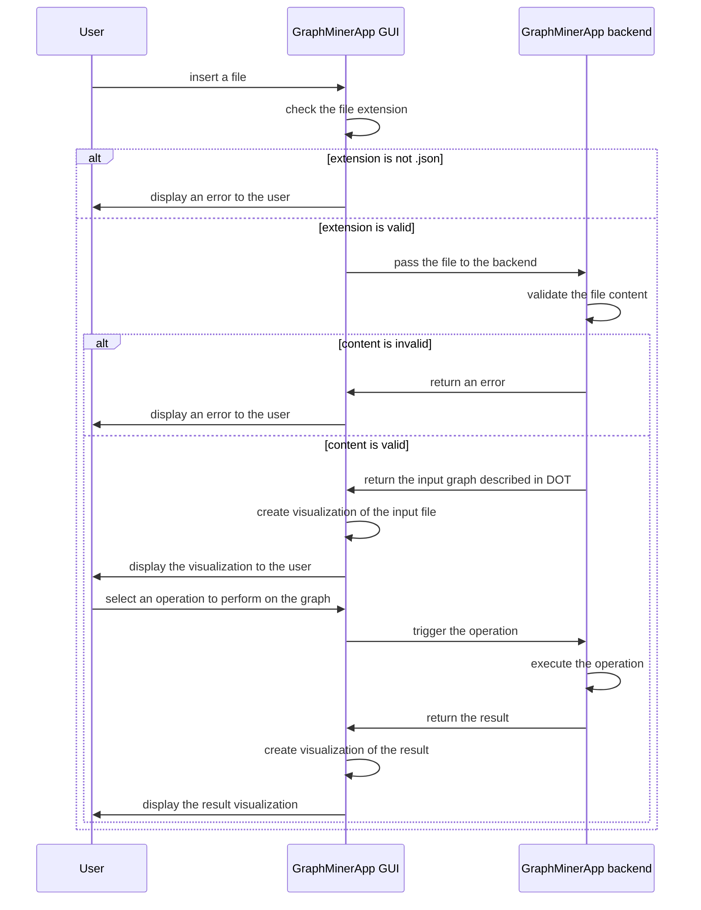

# GraphMiner
GraphMiner is an application which can be used for extracting structural patterns and valuable insights from
graph-structured data. It takes a JSON or GraphML file as input, validates it, and visualizes it. The user
can then choose which operations they want to perform on the graph.

## Planed features
- [ ] JSON schema validator
- [ ] GraphML schema validator
- [ ] JSON to graph structure
- [ ] GraphML to graph structure
- [ ] Visualize graphs
- [ ] gSPAN implementation
- [ ] FSM implementation

## Prerequisites
- Wails 2.10+
- Go 1.23+
- Node.js 22+

## Getting started
You can configure the project by editing `wails.json`. More information about the project settings can be found
here: https://wails.io/docs/reference/project-config

To run in live development mode, run `wails dev` in the project directory. This will run a Vite development
server that will provide very fast hot reload of your frontend changes. If you want to develop in a browser
and have access to your Go methods, there is also a dev server that runs on http://localhost:34115. Connect
to this in your browser, and you can call your Go code from devtools.

To build a redistributable, production mode package, use ` wails build`.

## Sequence diagram of app usage

## Used technologies
Application is created with [wails.io](https://wails.io/).

  &nbsp;
  &nbsp;
  &nbsp;
  &nbsp;

